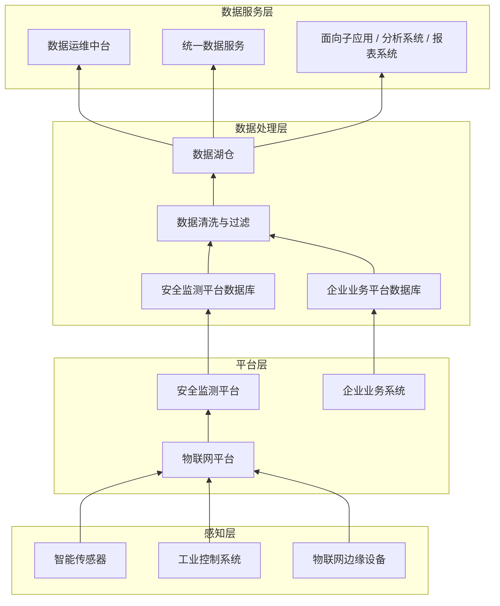

```mermaid
graph BT
  %% 数据服务层
  subgraph A[数据服务层]
    A1[数据运维中台]
    A2[统一数据服务]
    A3[面向子应用 / 分析系统 / 报表系统]
  end

  %% 数据处理层
  subgraph B[数据处理层]
    B1[数据湖仓]
    B2[数据清洗与过滤]
    B3[安全监测平台数据库]
    B4[企业业务平台数据库]
  end

  %% 平台层
  subgraph C[平台层]
    C1[安全监测平台]
    C2[物联网平台]
    C3[企业业务系统]
  end

  %% 感知层
  subgraph D[感知层]
    D1[智能传感器]
    D2[工业控制系统]
    D3[物联网边缘设备]
  end

  %% 连接关系（从下往上）
  D1 --> C2
  D2 --> C2
  D3 --> C2
  C2 --> C1
  C1 --> B3

  C3 --> B4

  B3 --> B2
  B4 --> B2
  B2 --> B1

  B1 --> A1
  B1 --> A2
  B1 --> A3
```